# Season Year Tracking Analysis

**Status:** CRITICAL - Multiple sources of truth causing synchronization failures
**Created:** 2025-10-26
**Current State:** System has 10+ year/season tracking mechanisms with no clear authority

---

## Executive Summary

The Owner's Sim currently tracks season years in **10+ different locations** with **no single source of truth**. This causes severe synchronization issues where:

- Dynasty shows season=2025 in database
- Controller has season_year=2027 in memory
- Playoff games for 2025, 2026, AND 2027 all exist simultaneously
- Handlers initialized with stale year values never update
- Season increments happen at wrong times

**Impact:** Season transitions fail, games don't execute, playoff brackets show wrong years.

---

## Current Season Year Storage Locations

### 1. **Database: dynasty_state.season** ⭐ INTENDED Source of Truth
**Location:** `data/database/nfl_simulation.db` → `dynasty_state` table
**Schema:**
```sql
CREATE TABLE dynasty_state (
    dynasty_id TEXT NOT NULL,
    season INTEGER NOT NULL,          -- ← Season year stored here
    current_date TEXT NOT NULL,
    current_phase TEXT NOT NULL,
    current_week INTEGER,
    ...
)
```

**Current Value:** `season=2025` for dynasty '1st'
**Updated By:** `DynastyStateAPI.update_state()`
**Authority:** Should be the single source of truth but isn't respected everywhere

---

### 2. **SeasonCycleController.season_year** ❌ Desynchronized
**Location:** `src/season/season_cycle_controller.py:123`
**Type:** Instance attribute (`self.season_year`)
**Initialized From:** Constructor parameter
**Current Value:** Likely 2027 (based on logs showing playoff_2027_* games)

**Assignment Points:**
```python
Line 123:  self.season_year = season_year          # Initialization
Line 954:  self.season_year += 1                   # OFFSEASON→PRESEASON transition
Line 1006: self.season_year = old_year             # Rollback on failure
Line 1739: self.season_controller.season_year = self.season_year  # Propagation
Line 1743: self.season_year = old_year             # Another rollback
Line 1945: self.season_year = season_year          # Temporary assignment
Line 1951: self.season_year = old_season_year      # Restore after temp
```

**Problem:** Referenced 59 times throughout the file, incremented in multiple places, but never synchronized back to database source of truth.

---

### 3. **SeasonPhaseTracker.season_year**
**Location:** `src/calendar/season_phase_tracker.py:66`
**Type:** Instance attribute in `SeasonPhaseState` dataclass
**Initialized:** Constructor parameter
**Authority:** Internal to CalendarComponent, returned via `get_phase_info()`

**Usage:**
```python
@dataclass
class SeasonPhaseState:
    current_phase: SeasonPhase
    phase_start_date: Date
    season_year: int                    # ← Tracked here
    completed_games: List[GameCompletionEvent]
    ...
```

**Problem:** Another independent copy of season_year, not synchronized with controller or database.

---

### 4. **PhaseState (Shared Object)** ✅ Phase Only, No Year
**Location:** `src/calendar/phase_state.py:18`
**Type:** Shared mutable object
**What It Tracks:** Only `SeasonPhase` enum (PRESEASON, REGULAR_SEASON, PLAYOFFS, OFFSEASON)
**What It Doesn't Track:** season_year ⚠️

**Good News:** This is properly shared across components
**Bad News:** Doesn't track year, so year still desynchronizes

---

### 5. **SimulationExecutor.season_year**
**Location:** `src/calendar/simulation_executor.py:101`
**Initialized From:**
```python
if season_year is None:
    phase_info = calendar.get_phase_info()
    self.season_year = phase_info.get("season_year", calendar.get_current_date().year)
else:
    self.season_year = season_year
```

**Problem:** Gets season_year from calendar's phase_info, which comes from SeasonPhaseTracker, not database. Yet another independent copy.

---

### 6. **UI SimulationController.season**
**Location:** `ui/controllers/simulation_controller.py:59`
**Type:** `self.season` (different name than season_year!)
**Initialized:** Constructor parameter from UI
**Passed To:** SeasonCycleController constructor

**Code:**
```python
def __init__(self, db_path: str, dynasty_id: str, season: int = 2025):
    self.season = season
    ...
    self.season_controller = SeasonCycleController(
        database_path=self.db_path,
        season_year=self.season,  # ← Passes UI's season to controller
        ...
    )
```

**Problem:** UI has its own copy, loads from somewhere (unclear), passes to controller. Not synchronized with database.

---

### 7. **Game IDs (Embedded Year)** 🔴 Multiple Conflicting Years
**Location:** Event data in `events` table
**Format Examples:**
- `preseason_2026_1_1` (year 2026)
- `playoff_2025_wild_card_1` (year 2025)
- `playoff_2026_wild_card_1` (year 2026) ❌ Shouldn't exist yet
- `playoff_2027_wild_card_1` (year 2027) ❌ Definitely wrong!
- `game_20250904_18_at_24` (year 2025, regular season)
- `game_20260905_18_at_24` (year 2026, next season)

**Current Database State:**
```
25 playoff games ranging from playoff_2025_* to playoff_2027_*
```

**Problem:** Game IDs permanently encode year. If wrong year used during creation, the game_id is forever wrong.

---

### 8. **Event Data: parameters.season**
**Location:** `events.data` JSON field → `parameters.season`
**Example from playoff_2027 event:**
```json
{
  "parameters": {
    "away_team_id": 4,
    "home_team_id": 5,
    "week": 1,
    "season": 2027,              // ← Year embedded here too
    "season_type": "playoffs",
    "game_type": "wild_card",
    "game_date": "2028-01-18T00:00:00",
    ...
  }
}
```

**Problem:** Another embedded year in event data. Created using controller's season_year at time of creation.

---

### 9. **PlayoffController.season_year**
**Location:** `src/playoff_system/playoff_controller.py` (constructor parameter)
**Initialized:** Passed from SeasonCycleController
**Used For:**
- Generating playoff game IDs (`playoff_{season_year}_*`)
- Calculating Wild Card date (`season_year + 1` for January)
- Database queries

**Code:**
```python
def __init__(self, ..., season_year: int = 2024, ...):
    self.season_year = season_year
```

**Problem:** Gets whatever season_year the calling controller has, which may be wrong. Used to create game_ids that then become permanent.

---

### 10. **Phase Transition Handlers (Static Year at Creation)**
**Location:** Handler classes initialized in `season_cycle_controller.py:202-211`

**Offseason→Preseason Handler:**
```python
offseason_to_preseason_handler = OffseasonToPreseasonHandler(
    ...
    new_season_year=season_year + 1,  # ← Calculated at CONTROLLER INIT
    ...
)
```

**Problem:** Handler created once with `season_year + 1`. If controller lives across multiple seasons:
- Year 2025: handler has new_season_year=2026 ✓
- Year 2026: handler STILL has new_season_year=2026 ❌ (should be 2027)
- Handler never updates, always uses stale year

**Other Handlers:**
- `RegularSeasonToPlayoffsHandler`: season_year=season_year (line 197)
- `PlayoffsToOffseasonHandler`: season_year=season_year (line 189)

All initialized once with static values, never updated.

---

## Synchronization Flow (How It's Supposed to Work)


---

## Synchronization Flow (What Actually Happens)

```mermaid
sequenceDiagram
    participant DB as dynasty_state.season
    participant UI as SimulationController.season
    participant SCC as SeasonCycleController.season_year
    participant Handlers as Transition Handlers
    participant PC as PlayoffController.season_year

    Note over DB: season=2025
    UI->>SCC: Initialize(season=2025)
    SCC->>Handlers: Create with new_season_year=2026

    Note over SCC: Regular season → Playoffs
    SCC->>PC: Initialize(season_year=2025)
    PC->>DB: Create playoff_2025_* games ✓

    Note over SCC: Playoffs → Offseason
    Note over SCC: (No season increment)

    Note over SCC: Offseason → Preseason
    SCC->>SCC: season_year += 1 (now 2026)
    SCC->>DB: update_state(season=2026)
    SCC->>Handlers: Execute (uses stale new_season_year=2026)

    Note over SCC: Regular season → Playoffs (year 2026)
    SCC->>PC: Initialize(season_year=2026) ❌
    PC->>DB: Create playoff_2026_* games ❌ Wrong!

    Note over UI: App restarts, loads dynasty
    UI->>DB: Load state (season=2025 still?)
    UI->>SCC: Initialize(season=2025) ❌
    SCC->>SCC: But internally has season_year=2026 or 2027?

    Note over SCC: _restore_playoff_controller()
    SCC->>PC: Initialize(season_year=2027) ❌❌
    PC->>DB: Create playoff_2027_* games ❌❌ Very wrong!
```



---

## Root Causes of Desynchronization

### 1. **No Single Source of Truth**
- Database has `season=2025`
- Controller has `season_year=2027`
- Events have games for 2025, 2026, AND 2027
- No authority to resolve conflicts

### 2. **Increment Without Synchronization**
```python
# Line 954: Increment happens
self.season_year += 1

# Line 980: Database updated
self.dynasty_api.update_state(..., season=self.season_year, ...)
```

But:
- SeasonPhaseTracker never updated
- SimulationExecutor never updated
- UI controller never notified
- Handlers retain old values

### 3. **Handlers Initialized Once with Static Values**
```python
# At controller init (season=2025):
offseason_to_preseason_handler = OffseasonToPreseasonHandler(
    new_season_year=season_year + 1  # 2026
)

# Later, when season_year=2026:
# Handler still has new_season_year=2026 ❌
# Should be 2027 but never updates
```

### 4. **Playoff Restoration Uses Wrong Year**
```python
def _restore_playoff_controller(self):
    # Uses self.season_year which may be wrong
    self.playoff_controller = PlayoffController(
        season_year=self.season_year,  # ❌ If this is 2027, creates playoff_2027_* games
        ...
    )
```

If restoration happens when season_year is desynchronized (2027 instead of 2025), it creates playoff games for the wrong year!

### 5. **No Validation/Reconciliation**
No code checks:
- "Does controller's season_year match database?"
- "Do existing playoff games match current season_year?"
- "Is season_year within valid range given current date?"

---

## Evidence from Logs

### Database Shows season=2025
```sql
SELECT season, current_date, current_phase FROM dynasty_state WHERE dynasty_id='1st';
-- Result: 2025 | 2026-08-21 | offseason
```

### Playoff Games for THREE Different Years
```sql
SELECT COUNT(*), MIN(game_id), MAX(game_id)
FROM events
WHERE game_id LIKE 'playoff_%' AND dynasty_id='1st';
-- Result: 25 | playoff_2025_conference_1 | playoff_2027_wild_card_6
```

This is physically impossible! Cannot have playoffs for 2025, 2026, AND 2027 simultaneously.

### Controller Looking for 2027 Milestones
```
Error: PRESEASON_START milestone not found for season 2027
Current Date: 2026-08-21
Dynasty: 1st
```

Controller thinks it's season 2027, looking for 2027 milestones, but:
- Database says season=2025
- Current date is Aug 2026
- Should be in offseason of 2025 season, about to start 2026 season

---

## Impact on System Components

### Game Execution
❌ **BROKEN**: Executor looks for `preseason_2025_*` but games are `preseason_2026_*`

### Playoff Brackets
❌ **BROKEN**: Showing playoff_2027_* games when should show playoff_2025_* (previous season)

### Statistics Queries
⚠️ **AT RISK**: If querying by season_year, may query wrong season data

### Event Scheduling
❌ **BROKEN**: Schedule release generates 2026 games, but executor can't find them because season_year doesn't match

### Phase Transitions
❌ **BROKEN**: Can't find milestones because looking for wrong year

---

## Recommended Solution: Single Source of Truth Pattern

### Design Principle
**The database `dynasty_state.season` column SHALL be the ONLY authoritative source for season year.**

All other season_year attributes SHALL be:
1. **Loaded from database** at initialization
2. **Synchronized to database** after any increment
3. **Re-loaded from database** before critical operations
4. **Validated against database** to detect drift

### Specific Changes Required

#### 1. **Make dynasty_state.season the Authority**

```python
class SeasonCycleController:
    def __init__(self, ...):
        # DON'T accept season_year parameter
        # ALWAYS load from database
        state = self.dynasty_api.get_current_state(dynasty_id, ...)
        self.season_year = state['season']  # ← From database only
```

#### 2. **Synchronize After Every Increment**

```python
def _increment_season_year(self):
    """Increment season year with database synchronization."""
    old_year = self.season_year
    self.season_year += 1

    # IMMEDIATELY sync to database
    self.dynasty_api.update_state(
        dynasty_id=self.dynasty_id,
        season=self.season_year,
        ...
    )

    # PROPAGATE to all components
    self.simulation_executor.season_year = self.season_year
    if self.season_controller:
        self.season_controller.season_year = self.season_year

    # RECREATE handlers with new year
    self._reinitialize_transition_handlers()
```

#### 3. **Make Handlers Dynamic, Not Static**

Instead of:
```python
# Created once at init with static value
offseason_to_preseason_handler = OffseasonToPreseasonHandler(
    new_season_year=season_year + 1
)
```

Do:
```python
# Handler gets season_year at EXECUTION time
class OffseasonToPreseasonHandler:
    def execute(self, transition, season_year):  # ← Parameter added
        # Use passed season_year, not stored value
        upcoming_season = season_year + 1
        ...
```

#### 4. **Add Validation Guards**

```python
def _validate_season_year_sync(self):
    """Ensure controller matches database."""
    db_state = self.dynasty_api.get_current_state(self.dynasty_id, self.season_year)
    db_season = db_state['season']

    if self.season_year != db_season:
        self.logger.warning(
            f"Season year desync detected! "
            f"Controller={self.season_year}, Database={db_season}. "
            f"Syncing from database (source of truth)."
        )
        self.season_year = db_season
        return False
    return True
```

Call this:
- Before every phase transition
- Before playoff controller creation
- After loading saved dynasty

#### 5. **Remove Year from Game IDs** (Future Enhancement)

Game IDs currently encode year permanently (`playoff_2027_wild_card_1`). This makes them brittle.

Better approach:
```python
# Instead of: playoff_2027_wild_card_1
# Use: playoff_wild_card_1 (year comes from event.parameters.season)
```

This way, year is metadata, not identity.

---

## Migration Path

### Phase 1: Add Validation (Low Risk)
- Add `_validate_season_year_sync()` method
- Call before critical operations
- Log warnings but don't fail
- **Goal:** Detect drift before fixing it

### Phase 2: Centralize Loading (Medium Risk)
- Remove season_year from controller constructors
- Always load from database in `__init__`
- UI passes dynasty_id only, not season
- **Goal:** One place to load year

### Phase 3: Fix Synchronization (High Risk)
- Create `_increment_season_year()` method
- Replace all `self.season_year += 1` with method call
- Propagate to all components
- Recreate handlers with new year
- **Goal:** Keep everything synchronized

### Phase 4: Make Handlers Dynamic (High Risk)
- Change handler signatures to accept season_year at execution
- Remove static season_year from handler constructors
- **Goal:** Handlers never stale

---

## Testing Strategy

### Unit Tests
```python
def test_season_year_matches_database():
    controller = SeasonCycleController(...)
    db_season = get_database_season(controller.dynasty_id)
    assert controller.season_year == db_season

def test_season_increment_syncs_to_database():
    controller = SeasonCycleController(...)
    old_year = controller.season_year
    controller._increment_season_year()

    db_season = get_database_season(controller.dynasty_id)
    assert controller.season_year == old_year + 1
    assert db_season == old_year + 1

def test_handlers_use_current_year_not_stale():
    controller = SeasonCycleController(...)
    controller.season_year = 2025

    # Simulate season passing
    controller._increment_season_year()
    assert controller.season_year == 2026

    # Execute handler - should use 2026, not 2025
    result = controller.phase_transition_manager.execute_transition(...)
    assert result['new_season_year'] == 2027  # 2026 + 1
```

### Integration Tests
```python
def test_full_season_cycle_year_tracking():
    controller = SeasonCycleController(...)

    # Start: season=2025
    assert controller.season_year == 2025
    assert get_db_season() == 2025

    # Regular season → Playoffs
    controller.advance_to_playoffs()
    assert controller.season_year == 2025  # No increment yet

    # Playoffs → Offseason
    controller.advance_to_offseason()
    assert controller.season_year == 2025  # Still same year

    # Offseason → Preseason (NEW SEASON!)
    controller.advance_to_preseason()
    assert controller.season_year == 2026  # NOW increments
    assert get_db_season() == 2026  # Database matches

    # Check handlers use new year
    games = get_preseason_games()
    assert all(g.startswith('preseason_2026_') for g in games)
```

---

## Current System Status

### What Works
✅ PhaseState properly shared (but doesn't track year)
✅ Database stores season year
✅ DynastyStateAPI provides clean interface

### What's Broken
❌ 10+ independent copies of season_year
❌ No synchronization between copies
❌ Handlers initialized with static values
❌ Playoff restoration creates wrong-year games
❌ Executor can't find games due to year mismatch
❌ Multiple playoff game sets for different years exist simultaneously

### Severity
🔴 **CRITICAL** - Prevents season progression, blocks gameplay

---

## Conclusion

The current year tracking system has **no single source of truth**, leading to severe desynchronization where:
- Controllers think it's 2027
- Database shows 2025
- Games exist for 2025, 2026, AND 2027
- System completely broken

**Recommendation:** Implement Single Source of Truth pattern with dynasty_state.season as authority. Add validation, centralize loading, fix synchronization, and make handlers dynamic.

**Priority:** CRITICAL - fix immediately to restore season progression functionality.