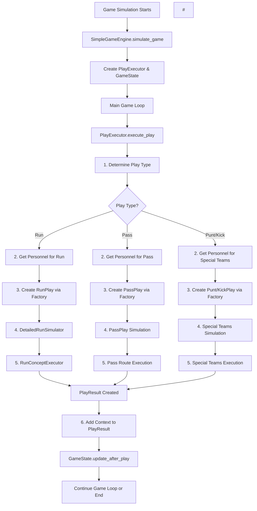

# Run Play Execution Path

This document provides a comprehensive flow diagram and explanation of how a run play is executed from the initial call to the final `PlayResult`.

## High-Level Execution Flow



## Detailed Component Breakdown

### 1. Game Orchestrator (`SimpleGameEngine`)

**File**: `src/game_engine/core/game_orchestrator.py`

**Responsibilities**:
- Manages overall game simulation
- Maintains team data and rosters
- Controls main game loop (up to 200 plays max)
- Handles possession changes and scoring

**Key Methods**:
```python
simulate_game(home_team_id, away_team_id) -> GameResult
```

**Flow**:
1. Get team data for both teams
2. Initialize `PlayExecutor` and `GameState`
3. Set initial possession and field position
4. Main game loop until game over or max plays reached
5. For each play: **call PlayExecutor.execute_play()** → update game state → handle special situations

**Note**: All play logic (determining type, personnel, simulation) happens **within** the `execute_play()` method.

### 2. Play Executor (`PlayExecutor`)

**File**: `src/game_engine/core/play_executor.py`

**Responsibilities**:
- **Single entry point** for all play execution via `execute_play()` method
- Determines play type based on game situation (first step)
- Manages personnel selection for chosen play type
- Orchestrates play simulation via appropriate play class
- Adds context and applies post-play effects

**Execution Steps** (All happen within `execute_play` method):
```python
def execute_play(offense_team, defense_team, game_state) -> PlayResult:
    # Step 1: Determine play type based on game situation
    play_type = self._determine_play_type(game_state.field)
    
    # Step 2: Get personnel packages for both teams
    personnel = PlayerSelector.get_personnel(
        offense_team, defense_team, play_type, game_state.field
    )
    
    # Step 3: Create appropriate play instance via factory
    play_instance = PlayFactory.create_play(play_type, self.config)
    
    # Step 4: Execute the play simulation
    play_result = play_instance.simulate(
        offense_team, defense_team, game_state.field
    )
    
    # Step 5: Add context information to result
    self._add_context_to_result(play_result, personnel, game_state)
    
    # Step 6: Apply post-play effects (fatigue, etc.)
    PlayerSelector.apply_fatigue(personnel.offensive_players, play_result)
    
    return play_result
```

### 3. Play Type Determination Logic

**When**: First step within `PlayExecutor.execute_play()`  
**Method**: `PlayExecutor._determine_play_type(field_state)`

**Decision Matrix**:

| Down | Yards to Go | Primary Choice | Secondary Choice |
|------|-------------|----------------|------------------|
| 4th  | >8 yards    | Punt (100%)    | - |
| 4th  | ≤3 yards    | Run (100%)     | - |
| 4th  | 4-8 yards   | Field Goal (60%) | Punt (40%) |
| 1st-3rd | ≥8 yards | Pass (70%)     | Run (30%) |
| 1st-3rd | ≤3 yards | Run (60%)      | Pass (40%) |
| 1st-3rd | 4-7 yards| Run (50%)      | Pass (50%) |

### 4. Player Selector (`PlayerSelector`)

**File**: `src/game_engine/personnel/player_selector.py`

**Dual Mode Operation**:

#### Legacy Mode (Team Ratings)
```python
offensive_players = {
    "qb": team["offense"]["qb_rating"],
    "rb": team["offense"]["rb_rating"], 
    "ol": team["offense"]["ol_rating"]
}
```

#### Individual Player Mode
```python
personnel = PersonnelPackage(
    rb_on_field=selected_rb,
    ol_on_field=[LT, LG, C, RG, RT],
    dl_on_field=[LE, DT, DT, RE], 
    lb_on_field=[LOLB, MLB, ROLB]
)
```

**Formation Selection Logic**:
- **Goal Line**: `field_position >= 90` → "goal_line" formation
- **Short Yardage**: `yards_to_go ≤ 3` → "i_formation" for runs
- **Long Yardage**: `yards_to_go >= 8` → "shotgun_spread"
- **Standard**: "singleback" for runs, "shotgun" for passes

### 5. Play Factory (`PlayFactory`)

**File**: `src/game_engine/plays/play_factory.py`

**Strategy Pattern Implementation**:
```python
@staticmethod
def create_play(play_type: str, config: Dict = None) -> PlayType:
    if play_type == "run":
        return RunPlay()
    elif play_type == "pass":
        return PassPlay()
    # ... other play types
```

### 6. Run Play Simulation (`RunPlay`)

**File**: `src/game_engine/plays/run_play.py`

**Simulation Approach**:

Uses `DetailedRunSimulator` with position-by-position blocking analysis and `RunConceptExecutor` for authentic NFL concepts.

## Enhanced Run Concepts System

### 7. Run Concepts (`RunConceptLibrary`)

**File**: `src/game_engine/plays/run_concepts.py`

**Seven NFL-Authentic Concepts**:

| Concept | Type | Target Gap | Blocking | RB Technique | Best Situations |
|---------|------|------------|----------|--------------|----------------|
| **Inside Zone** | Zone | Variable | Zone | One Cut | 1st/2nd Down, Any Distance |
| **Outside Zone** | Zone | C Gap | Reach | Bounce | 1st/2nd/3rd Down, Medium Distance |
| **Power O** | Gap | B Gap | Gap | Hit Gap | 3rd/4th Down, Short Distance, Goal Line |
| **Draw** | Draw | A Gap | Zone | Patient | 2nd/3rd Down, Long Distance |
| **Dive** | Gap | A Gap | Gap | Hit Gap | 3rd/4th Down, Short Distance |
| **Counter** | Gap | B Gap | Gap | Patient | 1st/2nd Down, Medium Distance |
| **Sweep** | Gap | Outside | Gap | Bounce | 1st/2nd Down, Any Distance |

### 8. Concept Selection Algorithm

```python
def select_concept_for_situation(field_state, formation, rb_style):
    # 1. Filter concepts suitable for situation
    suitable_concepts = [c for c in all_concepts if c.is_suitable_for_situation(field_state)]
    
    # 2. Apply formation preferences
    if formation in formation_preferences:
        preferred_concepts = filter_by_formation(suitable_concepts, formation)
    
    # 3. Apply RB style preferences  
    if rb_style in rb_preferences:
        style_preferred = filter_by_rb_style(preferred_concepts, rb_style)
    
    # 4. Random selection from remaining options
    return random.choice(final_concepts)
```

### 9. Run Concept Execution (`RunConceptExecutor`)

**Player-vs-Player Analysis**:
```python
def execute_concept(concept, rb, ol_players, dl_players, lb_players, field_state):
    # 1. Calculate concept-specific success factors
    success_factors = calculate_concept_success(concept, rb, ol_players, dl_players, lb_players)
    
    # 2. Determine base yards from player matchups
    base_yards = calculate_base_yards(concept, success_factors)
    
    # 3. Apply situational modifiers
    final_yards = apply_situational_modifiers(base_yards, concept, field_state)
    
    # 4. Determine outcome (gain/touchdown/fumble/safety)
    outcome = determine_outcome(final_yards, concept, rb, field_state)
    
    # 5. Generate realistic play description
    play_description = generate_play_description(concept, rb, final_yards, outcome)
    
    return detailed_result
```

**Success Factor Analysis**:
- **RB Attributes**: vision, power, speed, agility, elusiveness
- **OL Attributes**: mobility, power_blocking, run_blocking, anchor
- **DL Resistance**: gap_discipline, run_defense, pass_rushing (for draws)
- **LB Factors**: pursuit, discipline, coverage (for draws)

### 10. Detailed Run Simulator (`DetailedRunSimulator`)

**File**: `src/game_engine/plays/run_plays.py`

**Position-by-Position Simulation**:
```python
def simulate_run(offense, defense, play_call):
    # 1. Get relevant players for the play
    blockers, defenders = get_run_participants(offense, defense, play_call)
    
    # 2. Simulate blocking matchups using BlockingSimulator
    blocking_results = blocking_simulator.simulate_matchups(blockers, defenders, context)
    
    # 3. Calculate RB vs unblocked defenders
    rb_performance = simulate_rb_vs_defenders(rb_rating, blocking_results, defense, play_call)
    
    # 4. Calculate final yards and outcome
    yards, outcome = calculate_final_result(blocking_results, rb_performance, play_call)
    
    # 5. Generate detailed play breakdown
    breakdown = generate_play_breakdown(blocking_results, rb_performance, outcome, yards)
```

## PlayResult Data Structure

**File**: `src/game_engine/plays/data_structures.py`

```python
@dataclass
class PlayResult:
    # Core Information
    play_type: str              # "run", "pass", "punt", "field_goal"  
    outcome: str                # "gain", "touchdown", "fumble", etc.
    yards_gained: int           # -10 to 80+ yards
    time_elapsed: int           # seconds off clock
    is_turnover: bool           # fumble, interception
    is_score: bool              # touchdown, field goal, safety
    score_points: int           # points scored (0, 2, 3, 6)
    
    # Enhanced Tracking
    primary_player: Optional[str]     # Ball carrier
    tackler: Optional[str]            # Tackler
    formation: Optional[str]          # Offensive formation
    defensive_call: Optional[str]     # Defense scheme
    play_description: str             # Human-readable description
    
    # Context Information
    down: int                   # Down when executed
    distance: int               # Yards needed for first down
    field_position: int         # Starting yard line
    quarter: int                # Quarter
    game_clock: int             # Time remaining
    
    # Advanced Metrics
    big_play: bool              # 20+ yard gain
    goal_line_play: bool        # Inside 10 yard line
```

## Game State Updates

**File**: `src/game_engine/field/game_state.py`

**After Play Updates**:
```python
def update_after_play(self, play_result) -> str:
    # 1. Update field position and downs
    field_result = self.field.update_down(play_result.yards_gained)
    
    # 2. Update game clock
    self.clock.run_time(play_result.time_elapsed)
    
    # 3. Handle clock stoppage situations
    if play_result.outcome in ["incomplete", "out_of_bounds", "penalty"]:
        self.clock.stop_clock()
    
    # 4. Update scoreboard for scores
    if play_result.is_score:
        self.scoreboard.add_points(possession_team_id, play_result.score_points)
    
    return field_result  # "touchdown", "first_down", "turnover_on_downs", etc.
```

## Configuration Options

The system supports various configuration modes:

### Individual Player Mode  
```python
player_selector = PlayerSelector(use_individual_players=True)
player_selector.set_team_rosters(generated_rosters)
# Uses individual player attributes and run concepts with detailed simulation
```

### Run Concepts Integration
```python
# Automatic concept selection based on situation
concept = RunConceptLibrary.select_concept_for_situation(field_state, formation, rb_style)

# Manual concept testing
concept = RunConceptLibrary.get_all_concepts()[0]  # Inside Zone
result = RunConceptExecutor.execute_concept(concept, rb, ol_players, dl_players, lb_players, field_state)
```

## Future Enhancement Opportunities

1. **AI Play Calling**: Replace random play selection with intelligent AI decision making
2. **Player Fatigue System**: More sophisticated fatigue calculations affecting performance  
3. **Weather/Field Conditions**: Environmental factors affecting play outcomes
4. **Advanced Analytics**: EPA (Expected Points Added), success rate tracking, situational analysis
5. **Coaching Tendencies**: Team-specific play calling patterns and preferences
6. **Injury System**: Dynamic injury risk and impact during plays
7. **Momentum/Morale**: Psychological factors affecting team performance

## Testing

Two test scripts are available for validating the run play system:

- **`test_run_simple.py`**: Quick validation with sample scenarios
- **`test_run_concepts.py`**: Comprehensive interactive testing suite

```bash
# Quick test
python test_run_simple.py

# Interactive testing  
python test_run_concepts.py
```

Both scripts demonstrate the complete execution path from team setup through play execution to final results, validating the entire run play pipeline.